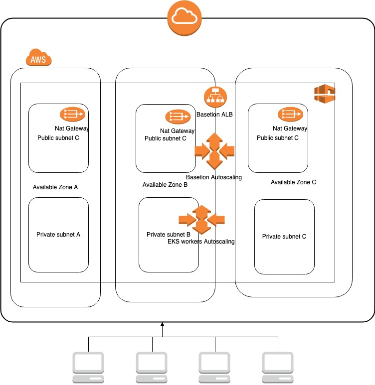

Branch|Build Status
--------|--------------
Master|[](https://circleci.com/gh/brianhhq/simple-go-web-app)

# Simple Go Web App
The purpose of this project demos how simple go application work.

# AWS Infrastructure

See: [terraform/README.md](terraform/README.md)

## Getting Started

These instructions will get you a copy of the project up and running on your local machine for development and testing purposes. 

### Prerequisites

What things you need to install the software and how to install them.
* Download and install [Docker](https://www.docker.com/get-started)

### Installing

Download the images via command line

```
docker login
docker pull brianhhq/simple-go-web-app
```

### Usage

* Run the application
```         
docker run -d --name simple-go-web-app -p 8080:8080 brianhhq/simple-go-web-app
```


## Local Development - Go
### Build the app
```
go build main.go
```
### Run the app
```
./main
```
or 
```
go run main.go
```

## Local Development - Docker

* Clone this project

* How to Build image
```
docker build -t brianhhq/simple-go-web-app .
```

* Run the application `See Above`

* Enter the Container
```
docker exec -it simple-go-web-app sh
```

* Stop and Clean up
```
docker stop simple-go-web-app && docker rm simple-go-web-app
```

## Deployment
see [deployment/README.md](deployment/README.md)

### Highlight of the project
* [Infrastructure] Public subnets and private subnets have been created across multiple available zones. Multiple Nat gateways have also been creted for high availablity.
* [EKS] One Master control plane and workers autoscaling group have been created to make sure high avaliablity and self healing.
* [High Availablity and Seal Healing] Applications deployed in EKS automatically handled by EKS to make sure applciation high avilability across multiple available zones and self healing.
* [CI] Continuous Integration has been applied in this repo. CircleCI is chosen to be the CI tools to make sure building stuff faster, never shipping broken code and decreasing code review time.
* [Process Improvement]  Build caching mechanism has been considered to reduce the amount of building time.
* [Dockerization] Docker is chosen as a artifact as it increases CI Efficiency, simplifying configurations and ensures rapid deployment. It is also good to ship product across platform easily. 
* [Performance] The principle of minimum packages/images has been considered to ensure shipping smallest but functional application over low-bandwidth connection network.
* [Documentation] Documentation has been provided to make it easy for a user to run this program. Github integrates with CircleCI to quickly check the status of build status.
* [Unit Testing] Unit testing has been applied to ensure quality of code and find bugs earlier and easier.
* [Security] Branch protection rule(Signed Commit) has been applied. Commits pushed to matching branches must have [verified signatures](https://help.github.com/articles/signing-commits-using-gpg/) to ensure no one can pretend someone to commit. This is very important to large organisations with a lot of engineers. 
* [Security] Network security groups have been used to grant necessary access.
* [Security] Basetion servers have been created to allow necessary security updates and server maintainence.

### To dos
* Proxy servers to allow necessary outbound access.
* VPN servers to allow staff access VPC
* WAF to seucre application
* VPC flow logs and guard duty for extra security
* Cloudfront to ensure world class application performance.
